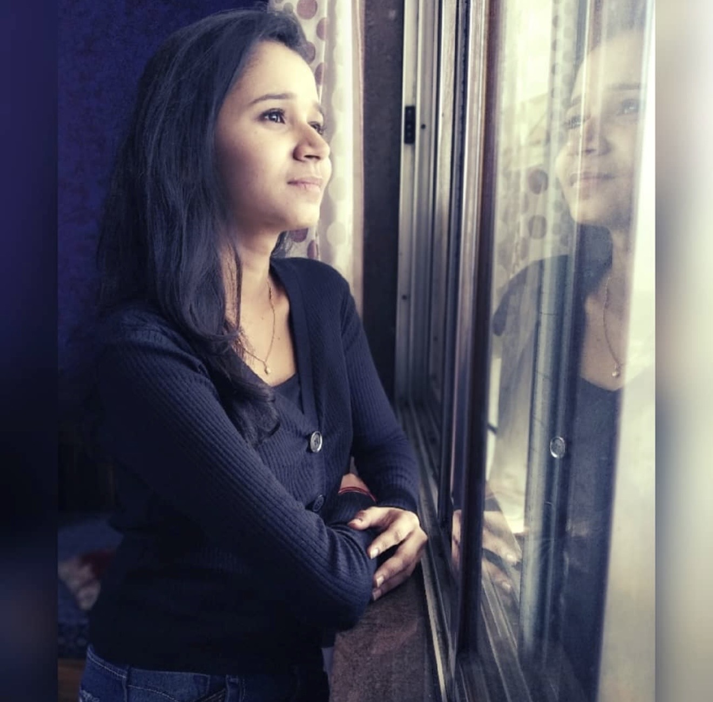

# Snehal Mastud — Portfolio

## Files
- `index.html` — Full portfolio markup
- `style.css`  — All styles (cinematic dark, gold accents, animations)
- `script.js`  — Cursor, scroll reveal, parallax, mobile menu, card tilt

---

## 📸 Adding Your Photos

### Hero photo (main large photo on right side)
1. Place your photo file (e.g. `snehal.jpg`) in this folder
2. Open `index.html` and find this comment:
   ```
   <!-- Uncomment below and replace with your actual photo path: -->
   ```
3. Uncomment the `` tag below it:
   ```html
   
   ```
4. Also delete or hide the `<div class="photo-placeholder">` above it

### About section photo
- Find `<div class="photo-placeholder-sm">` and replace with:
  ```html
  
  ```

**Photo tips:** Portrait orientation works best for hero. Square/landscape for about section. JPG at ~800kb is ideal.

---

## 🔗 Update Your Links

In `index.html`, update these:
- LinkedIn: Change `https://linkedin.com/in/snehalmastud` to your real URL
- GitHub: Change `https://github.com/snehalmastud` to your real URL

---

## ✨ Features
- Cinematic loader animation
- Smooth lagging custom cursor
- Split-screen hero (text + photo)
- Scrolling tech marquee strip
- Magnetic 3D tilt on project cards
- Scroll-reveal on all sections
- Sticky left panel on About/Skills/Contact
- Gold accent color scheme
- Parallax hero image on scroll
- Mobile hamburger menu
- Active nav highlight on scroll
